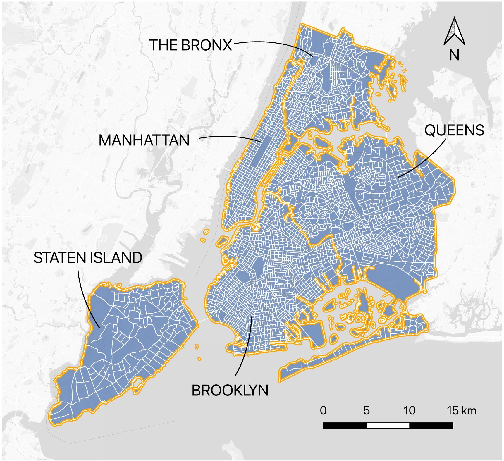
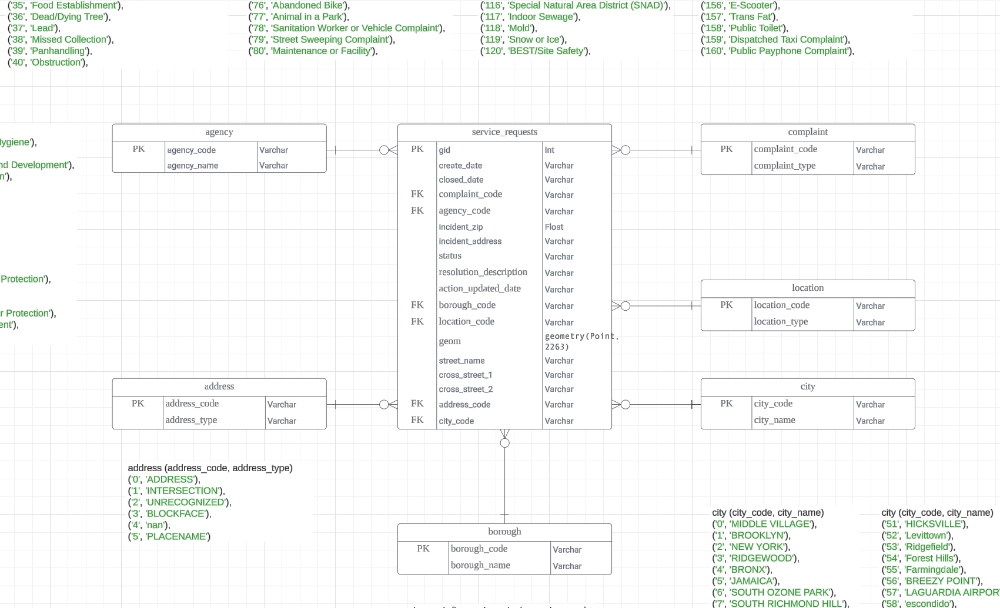
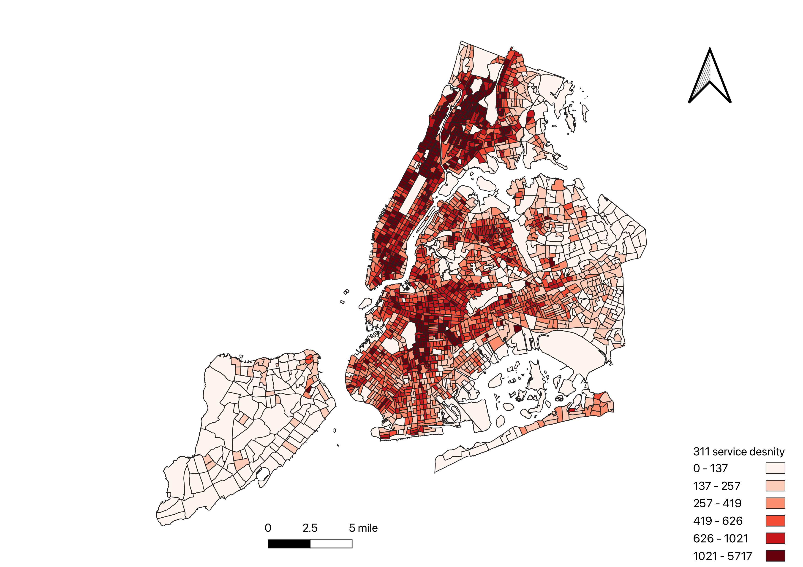
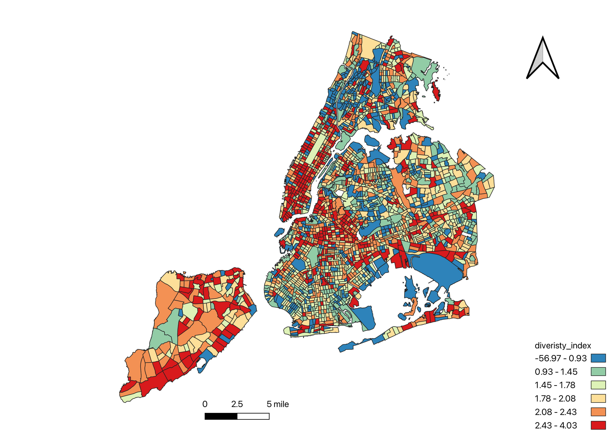
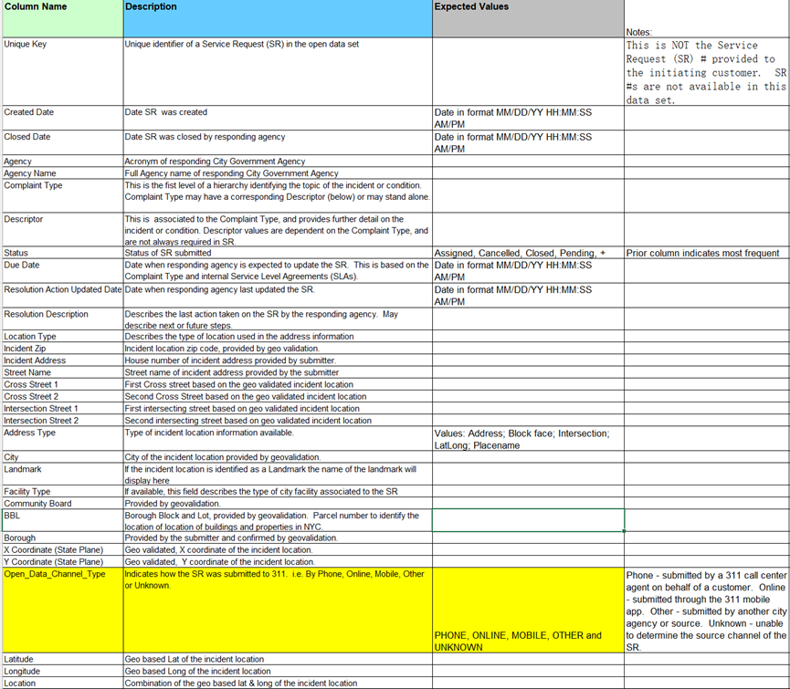

# Exploring the Spatial Relationship between 311 Requests and Urban characteristics

# Introduction

## Overview of GIS and SQL in Urban Analysis

As cities evolve into denser and more complex hubs of activity, the processes of urban management grow increasingly challenging. Cities are not just homes to vast populations; they also serve as the epicenters of social, cultural, and economic exchange. For urban authorities, the multitude of responsibilities now includes promptly responding to a diverse array of resident complaints and service needs.

In metropolises like New York City, the "311 request" system stands as a cornerstone of urban governance, offering a direct line for residents to voice concerns and request services ranging from waste removal and street repairs to addressing environmental issues. The efficacy of such a system is not just in its capacity to collect reports but also in harnessing this data to optimize city services and enhance quality of life.

Yet, the effective deployment of resources to address these requests requires a nuanced appreciation of the city's spatial dynamics. Each neighborhood exhibits unique social, economic, and environmental identities, which can reflect markedly in the nature and volume of 311 service requests. This project seeks to dissect the spatial patterns of 311 requests within New York City, revealing the interplay between citizen engagement and urban attributes.

With a dataset rich in geospatial and temporal information, we leverage Geographic Information Systems (GIS) and SQL to explore the spatial dimensions of urban service requests. Our quest is to shed light on the spatiotemporal distribution of these requests, investigating how they correlate with various urban factors such as population density, socioeconomic standings, and environmental indices.

Through the course of this report, we will engage with the dataset to address three pivotal spatial questions. These inquiries will guide our exploration of the most common types of service requests within each census tract, the density of these requests, and the variance in service request types across neighborhoods. By dissecting this data, we aim to offer actionable insights that can inform urban planning and public service strategies, ultimately contributing to the refined orchestration of city life in New York.

# Study Area and Dataset

## Study area

The study area encompassed the five boroughs in New York City: the Bronx, Brooklyn, Manhattan, Queens, and Staten Island. New York City is
renowned as one of the most populous and economically vibrant cities in the world.

Census tracts serve as spatial units of analysis in this study. We have 2,325 census tracts in total, allowing for a granular examination
of the relationship between various urban-related indicators and 311 requests at a localized level within New York City.



## Dataset

The data sources used in this study encompass two main categories. NYC 311 Service Request dataset is from NYC Open Data, representing
the year 2022. The census tracts were derived from the American Community Survey (ACS) 5-year Estimates in 2021, collected by the
U.S. Census Bureau. These requests cover a range of issues from infrastructure to environmental concerns, providing a window into the
urban challenges and needs.

We will use the dataset to answer spatial questions such as identifying areas with high service request densities or varied types of
requests. The analysis aims to assist in resource allocation and urban planning decisions.

# Data Structure and Normalization

## Data Description

The dataset we're analyzing comprises service requests submitted to a city's public service department. Each service request record
includes a unique identifier, details of the request type, the date it was created and closed, the agency responsible, and the location
information. Location data includes the coordinates, zip code, street address, and borough, which are essential for spatial analysis.

## Data Structure

The original dataset includes several columns:

- **Unique Key**: A unique identifier for each service request.
- **Created Date and Closed Date**: Timestamps for when the request was created and resolved.
- **Agency**: The code and name of the city agency responsible for handling the request.
- **Address**: The code and address type for the request.
- **Complaint Type**: A classification of the request, along with a more detailed descriptor.
- **Location Information**: Includes zip code, street address, and geographic coordinates (latitude and longitude).

## Normalization to 3NF

To optimize the database for query efficiency and maintain data integrity, we normalized the dataset to the Third Normal Form (3NF).
The normalization process involved decomposing a single, large table into smaller, related tables to eliminate redundancy and
dependencies that don't rely on the primary key. This was principally achieved by:

- **Introducing Codes**: Descriptive text fields were replaced with codes that correspond to entries in separate lookup tables. For example, instead of storing the full agency name in each service request record, we store an agency_code that references an entry in an agency table where the full name is stored only once.

- **Reduction in Table Size**: This approach significantly reduces the size of the main service_requests table, as it replaces lengthy text entries with short code identifiers, leading to less repetition of data.

- **Lookup Tables**: Each type of code has an associated lookup table, such as agency, complaint, location, city, and borough. These tables store detailed information corresponding to each code, which can be joined with the main table as needed for queries.

## Final Schema and ERD
The final schema is illustrated in an Entity-Relationship Diagram (ERD) that depicts the relationships between the normalized tables:

- **Service Requests**: The core table records each service request's unique identifier, dates, status, and foreign keys linking to other tables.
- **Agency**: Contains a list of agencies and their corresponding codes.
- **Complaint**: Catalogs the types of complaints and associates them with unique codes.
- **Location**: Includes location types and codes, which categorize the incident's place.
- **City**: Maintains a list of cities, identified by unique codes.
- **Borough**: Keeps a record of borough names and their associated codes.

Each table has a primary key (PK), such as gid for service requests or agency_code for agencies, ensuring unique identification. Foreign keys (FK) create relationships between tables. For example, service_requests references agency_code to tie a request to the responsible agency.

The schema adheres to normalization principles, especially in reducing table sizes and eliminating redundancy by using codes. This structure aligns with the Third Normal Form (3NF), where all the attributes in a table are only dependent on the primary key.



# Analytical Queries

## Query 1: Service Request Density Calculation

### Question: Calculate the density of service requests per square kilometer in each census tract.

```sql
    CREATE INDEX gid ON service_requests_2022 USING GIST (geom);
    SELECT 
        ct.gid,
        COUNT(sr.*) / (ST_Area(ct.geom)/ (10.7639 * 1000000)) AS service_density
    FROM 
        census_tract ct
    LEFT JOIN 
        service_requests_2022 sr ON ST_Contains(ct.geom, sr.geom)
    GROUP BY 
        ct.gid, ct.geom;
```

### Query Discussion

The query begins by ensuring that a spatial index is created on the geom column of the service_requests_2022 table. This index is critical for improving the performance of spatial queries, particularly those involving spatial joins and functions.

The SELECT statement calculates the service density for each census tract as follows:

- **FROM Clause**: We start with the census_tract table, which holds the geometry (geom) of each tract and a unique identifier (gid).

- **LEFT JOIN**: The LEFT JOIN ensures that we consider all census tracts, including those with no corresponding service requests. It joins the census_tract table with service_requests_2022 based on a spatial containment check.

- **ST_Contains**: This PostGIS spatial function checks whether the geometry of a service request (sr.geom) is within a census tract (ct.geom).

- **COUNT**: The aggregate function counts the number of service requests within each census tract.

- **ST_Area**: Another PostGIS function, ST_Area, is used to calculate the area of each census tract in square meters. Since our dataset uses the New York State Plane coordinate system (EPSG:2263), which measures distances in feet, we divide by 10.7639 to convert square feet to square meters, and then by 1,000,000 to convert to square kilometers.

- **GROUP BY**: This clause groups the result set by each unique census tract identifier (ct.gid), ensuring that service density is calculated separately for each tract.

Result: The result is the service density, which is the count of service requests per square kilometer for each census tract.

By utilizing a spatial index and PostGIS functions, this query efficiently calculates service densities across a geographic area, providing a crucial metric for urban planners and public service departments to understand and address the distribution of citizen service requests.



## Query 2: Identifying Common Complaint Types and Their Nearest Requests

### Question: For each census tract, identify which types of requests are most common and determine the location of the nearest such requests to the center of the tract.

 ```sql
    SELECT 
    ct.gid,
    common_complaints.complaint_code,
    sr.geom
    FROM
        census_tract ct
    CROSS JOIN LATERAL (
        SELECT
            complaint_code
        FROM 
            service_requests_2022
        WHERE
            ST_Contains(ct.geom, service_requests_2022.geom)
        GROUP BY 
            complaint_code
        ORDER BY 
            COUNT(*) DESC
        LIMIT 1
    ) AS common_complaints
    JOIN LATERAL (
        SELECT 
            geom
        FROM 
            service_requests_2022
        WHERE 
            service_requests_2022.complaint_code = common_complaints.complaint_code
        ORDER BY 
            ct.geom <-> service_requests_2022.geom
        LIMIT 1
    ) AS sr ON TRUE
    WHERE 
        ct.gid IS NOT NULL;
 ```

### Query Discussion

This query employs a combination of PostgreSQL's lateral joins and aggregate functions to accomplish a two-fold task:

1. **Identify the Most Common Complaint Type**:
    - The CROSS JOIN LATERAL performs a function similar to a correlated subquery that can reference columns from preceding parts of the query, namely census_tract ct.
    - Within this subquery, we're interested in finding the most common complaint_code for each census tract. This is determined by the ST_Contains spatial function, which ensures that we're only counting service requests within the bounds of the tract's geometry (ct.geom).
    - We group the results by complaint_code and order by the count in descending order, selecting the top result with LIMIT 1.

2. **Locate the Nearest Request of the Most Common Type**:
   - A second lateral join is used to find the closest service request with the common complaint_code identified in the first lateral join.
   - The operator <-> calculates the distance between geometries, allowing us to order the results by proximity to the tract's center and select the closest one using LIMIT 1.
   - It is important to note that the use of <-> for proximity ordering is greatly optimized by the GiST index on the geom column.

3. **Final Selection**:

   - The outer query selects the tract identifier (ct.gid), the most common complaint_code from the first lateral join, and the geometry of the nearest service request of that type from the second lateral join.
   - The ON TRUE condition in the JOIN clause is used with lateral joins to ensure that the join always succeeds.
   - The WHERE ct.gid IS NOT NULL filter ensures that only valid census tracts are included in the final result.

This query effectively combines spatial analysis with aggregate statistics to yield actionable insights for urban services, helping to prioritize resource allocation based on the prevalence and accessibility of service requests.

## Query 3: Identifying Areas with Diverse Service Requests

### Question: Determine which neighborhoods have the highest variance in the type of service requests

```sql
   SELECT 
    sr.gid,
    sr.geom,
    - SUM(
        (sr.count_type::float / sr.total_count::float) * 
        log(sr.count_type::float / sr.total_count::float)
      ) AS diversity_index
FROM (
    SELECT 
        ct.gid,
        ct.geom,
        sr.complaint_code,
        COUNT(*) AS count_type,
        COUNT(*) OVER (PARTITION BY ct.gid) AS total_count
    FROM 
        census_tract ct
    JOIN 
        service_requests_2022 sr ON ST_Contains(ct.geom, sr.geom)
    GROUP BY 
        ct.gid, sr.complaint_code
) sr
GROUP BY 
    sr.gid, sr.geom
ORDER BY 
    diversity_index DESC;
```

### Query Discussion

This query utilizes the Shannon Diversity Index, a concept from information theory commonly used in ecological studies, adapted here for urban service requests:

1. **Subquery Calculations**:

   - The subquery joins the census_tract table with service_requests_2022 using the ST_Contains function to ensure we only consider service requests that fall within each census tract.
   - It calculates two counts for each complaint type: count_type (the count of each complaint type within the tract) and total_count (the total number of service requests within the tract).

2. **Diversity Index**:

   - In the outer query, we compute the diversity index using the formula that takes the proportion of each type of service request (count_type / total_count) and multiplies it by the logarithm of the same proportion.
   - The negative sum of these values for all service request types within a census tract gives us the diversity index. A higher diversity index suggests a greater variety of service request types.

3. **Grouping and Ordering**:

   - Results are grouped by gid and geom to calculate the diversity index for each tract.
   - The ORDER BY clause sorts the neighborhoods by their diversity index in descending order, highlighting the areas with the greatest variance in service requests.

4. **Spatial Considerations**:
   - The query relies on the spatial relationship between service requests and census tracts, utilizing PostGIS functions to spatially join and analyze data.
   - The use of ST_Contains ensures spatial accuracy, only considering service requests that geographically fall within the census tract boundaries.

This query is an example of how spatial data can be combined with statistical methods to provide insights into the complexity of urban issues as represented by service requests. It helps urban planners and public service providers understand where a wide range of services might be required, potentially indicating diverse or multifaceted community needs.



# Appendices

## Appendix A: ETL Process

We got the 311_Service_Requests_2022 data from [NYC Open Data](https://opendata.cityofnewyork.us/), Census tracts data from [U.S. Census Bureau](https://www.census.gov/).

- Import 311 service requests csv data

```sql
ogr2ogr -f "PostgreSQL" PG:"dbname=gis user=docker password=docker host=localhost port=5433" "311_Service_Requests_2022.csv" -nln term_project.311_service_requests_2022 -lco PRECISION=NO -oo EMPTY_STRING_AS_NULL=YES
```
- Import ACS shapefile data
```sql
ogr2ogr -f "PostgreSQL" PG:"dbname=gis user=docker password=docker host=localhost port=5433" "2021_ACS_data.shp" -nln term_project.acs_data -lco GEOMETRY_NAME=geom -lco FID=gid -lco PRECISION=NO -t_srs "EPSG:2263"
```

## Appendix B: Normalization Scripts

Scripts used for data normalization as part of Milestone 3.

```sql
SET search_path TO term_project, public;

ALTER TABLE "311_service_requests_2022"
ADD COLUMN geom geometry(Point, 2263);

UPDATE "311_service_requests_2022"
SET geom = ST_Transform(ST_SetSRID(ST_MakePoint(longitude, latitude), 4326), 2263);


-- Table 'agency'
DROP TABLE IF EXISTS agency CASCADE;
CREATE TABLE agency (
    agency_code VARCHAR PRIMARY KEY,
    agency_name VARCHAR NOT NULL
);

-- Insert data into the agency table
INSERT INTO agency (agency_code, agency_name) VALUES
('DOHMH', 'Department of Health and Mental Hygiene'),
('NYPD', 'New York City Police Department'),
('HPD', 'Department of Housing Preservation and Development'),
('DEP', 'Department of Environmental Protection'),
('DOT', 'Department of Transportation'),
('DCA', 'Department of Consumer Affairs'),
('DHS', 'Department of Homeless Services'),
('DSNY', 'Department of Sanitation'),
('DOB', 'Department of Buildings'),
('DPR', 'Department of Parks and Recreation'),
('TLC', 'Taxi and Limousine Commission'),
('EDC', 'Economic Development Corporation'),
('NYC311-PRD', 'Department of Environmental Protection'),
('OTI', 'Office of Technology and Innovation'),
('DOE', 'Department of Education'),
('DCWP', 'Department of Consumer and Worker Protection'),
('OSE', 'Mayor’s Office of Special Enforcement'),
('DFTA', 'Department for the Aging');

-- Table 'complaint'
DROP TABLE IF EXISTS complaint CASCADE;
CREATE TABLE complaint (
    complaint_code VARCHAR PRIMARY KEY,
    complaint_type VARCHAR NOT NULL
);

-- Insert data into the complainttable
INSERT INTO complaint (complaint_code, complaint_type) VALUES
('0', 'Food Poisoning'),
('1', 'Illegal Fireworks'),
('2', 'Noise - Street/Sidewalk'),
('3', 'Noise - Residential'),
('4', 'Rodent'),
('5', 'Illegal Parking'),
('6', 'Abandoned Vehicle'),
('7', 'GENERAL'),
('8', 'Noise - Vehicle'),
('9', 'Blocked Driveway'),
('10', 'HEAT/HOT WATER'),
('11', 'Noise - Commercial'),
('12', 'Noise'),
('13', 'Traffic Signal Condition'),
('14', 'Consumer Complaint'),
('15', 'DOOR/WINDOW'),
('16', 'Homeless Person Assistance'),
('17', 'PAINT/PLASTER'),
('18', 'WATER LEAK'),
('19', 'PLUMBING'),
('20', 'UNSANITARY CONDITION'),
('21', 'ELECTRIC'),
('22', 'FLOORING/STAIRS'),
('23', 'Street Condition'),
('24', 'Sewer'),
('25', 'Water System'),
('26', 'Non-Residential Heat'),
('27', 'Dirty Condition'),
('28', 'Illegal Dumping'),
('29', 'Elevator'),
('30', 'Highway Condition'),
('31', 'Non-Emergency Police Matter'),
('32', 'Root/Sewer/Sidewalk Condition'),
('33', 'Animal-Abuse'),
('34', 'Street Light Condition'),
('35', 'Food Establishment'),
('36', 'Dead/Dying Tree'),
('37', 'Lead'),
('38', 'Missed Collection'),
('39', 'Panhandling'),
('40', 'Obstruction'),
('41', 'Air Quality'),
('42', 'Special Projects Inspection Team (SPIT)'),
('43', 'For Hire Vehicle Complaint'),
('44', 'Illegal Posting'),
('45', 'Noise - House of Worship'),
('46', 'Litter Basket Request'),
('47', 'Dead Animal'),
('48', 'Graffiti'),
('49', 'Taxi Complaint'),
('50', 'Drinking'),
('51', 'Drug Activity'),
('52', 'New Tree Request'),
('53', 'Sidewalk Condition'),
('54', 'Smoking'),
('55', 'Traffic'),
('56', 'Boilers'),
('57', 'SAFETY'),
('58', 'Damaged Tree'),
('59', 'Hazardous Materials'),
('60', 'Building/Use'),
('61', 'Indoor Air Quality'),
('62', 'General Construction/Plumbing'),
('63', 'Ferry Complaint'),
('64', 'Mobile Food Vendor'),
('65', 'Unleashed Dog'),
('66', 'Plumbing'),
('67', 'Residential Disposal Complaint'),
('68', 'Broken Parking Meter'),
('69', 'Street Sign - Missing'),
('70', 'APPLIANCE'),
('71', 'Encampment'),
('72', 'Electronics Waste Appointment'),
('73', 'Lost Property'),
('74', 'Street Sign - Damaged'),
('75', 'Outdoor Dining'),
('76', 'Abandoned Bike'),
('77', 'Animal in a Park'),
('78', 'Sanitation Worker or Vehicle Complaint'),
('79', 'Street Sweeping Complaint'),
('80', 'Maintenance or Facility'),
('81', 'ELEVATOR'),
('82', 'Unsanitary Pigeon Condition'),
('83', 'Illegal Tree Damage'),
('84', 'Overgrown Tree/Branches'),
('85', 'Lot Condition'),
('86', 'Green Taxi Complaint'),
('87', 'Street Sign - Dangling'),
('88', 'Taxi Report'),
('89', 'Water Conservation'),
('90', 'Highway Sign - Dangling'),
('91', 'Asbestos'),
('92', 'Violation of Park Rules'),
('93', 'Electrical'),
('94', 'Curb Condition'),
('95', 'Derelict Vehicles'),
('96', 'Dumpster Complaint'),
('97', 'Emergency Response Team (ERT)'),
('98', 'Industrial Waste'),
('99', 'Water Quality'),
('100', 'Commercial Disposal Complaint'),
('101', 'Litter Basket Complaint'),
('102', 'Construction Lead Dust'),
('103', 'Uprooted Stump'),
('104', 'Real Time Enforcement'),
('105', 'Green Taxi Report'),
('106', 'Noise - Park'),
('107', 'Noise - Helicopter'),
('108', 'Bike Rack Condition'),
('109', 'Urinating in Public'),
('110', 'Day Care'),
('111', 'Tattooing'),
('112', 'Bike/Roller/Skate Chronic'),
('113', 'Unsanitary Animal Pvt Property'),
('114', 'Highway Sign - Damaged'),
('115', 'Municipal Parking Facility'),
('116', 'Special Natural Area District (SNAD)'),
('117', 'Indoor Sewage'),
('118', 'Mold'),
('119', 'Snow or Ice'),
('120', 'BEST/Site Safety'),
('121', 'OUTSIDE BUILDING'),
('122', 'Posting Advertisement'),
('123', 'Bus Stop Shelter Complaint'),
('124', 'Illegal Animal Kept as Pet'),
('125', 'Scaffold Safety'),
('126', 'Harboring Bees/Wasps'),
('127', 'Radioactive Material'),
('128', 'Ferry Inquiry'),
('129', 'LinkNYC'),
('130', 'Beach/Pool/Sauna Complaint'),
('131', 'For Hire Vehicle Report'),
('132', 'Drinking Water'),
('133', 'Investigations and Discipline (IAD)'),
('134', 'Pet Shop'),
('135', 'Unsanitary Animal Facility'),
('136', 'Animal Facility - No Permit'),
('137', 'Wood Pile Remaining'),
('138', 'School Maintenance'),
('139', 'Bus Stop Shelter Placement'),
('140', 'ZTESTINT'),
('141', 'X-Ray Machine/Equipment'),
('142', 'Borough Office'),
('143', 'Taxi Licensee Complaint'),
('144', 'Building Drinking Water Tank'),
('145', 'Building Condition'),
('146', 'Adopt-A-Basket'),
('147', 'Window Guard'),
('148', 'Found Property'),
('149', 'Bridge Condition'),
('150', 'Disorderly Youth'),
('151', 'Cranes and Derricks'),
('152', 'Tunnel Condition'),
('153', 'Illegal Animal Sold'),
('154', 'Squeegee'),
('155', 'Seasonal Collection'),
('156', 'E-Scooter'),
('157', 'Trans Fat'),
('158', 'Public Toilet'),
('159', 'Dispatched Taxi Complaint'),
('160', 'Public Payphone Complaint'),
('161', 'Retailer Complaint'),
('162', 'Taxi Compliment'),
('163', 'Cooling Tower'),
('164', 'Plant'),
('165', 'Calorie Labeling'),
('166', 'AHV Inspection Unit'),
('167', 'Incorrect Data'),
('168', 'Recycling Basket Complaint'),
('169', 'Highway Sign - Missing'),
('170', 'Poison Ivy'),
('171', 'Private School Vaccine Mandate Non-Compliance'),
('172', 'FHV Licensee Complaint'),
('173', 'Oil or Gas Spill'),
('174', 'Institution Disposal Complaint'),
('175', 'Lifeguard'),
('176', 'DSNY Internal'),
('177', 'Bottled Water'),
('178', 'DEP Sidewalk Condition'),
('179', 'DEP Street Condition'),
('180', 'Dept of Investigations'),
('181', 'Standing Water'),
('182', 'Mosquitoes'),
('183', 'Transfer Station Complaint'),
('184', 'Internal Code'),
('185', 'Special Operations'),
('186', 'Request Large Bulky Item Collection'),
('187', 'Vaccine Mandate Non-Compliance'),
('188', 'DEP Highway Condition');

-- Table 'location'
DROP TABLE IF EXISTS location CASCADE;
CREATE TABLE location (
    location_code VARCHAR PRIMARY KEY,
    location_type VARCHAR NOT NULL
);

-- Insert data into the location table
INSERT INTO location (location_code, location_type) VALUES
('0', 'Restaurant/Bar/Deli/Bakery'),
('1', 'Street/Sidewalk'),
('2', 'Residential Building/House'),
('3', '3+ Family Apt. Building'),
('4', 'RESIDENTIAL BUILDING'),
('5', 'Store/Commercial'),
('6', 'Park/Playground'),
('7', 'nan'),
('8', 'Business'),
('9', 'Club/Bar/Restaurant'),
('10', 'Building (Non-Residential)'),
('11', 'Sidewalk'),
('12', 'Highway'),
('13', 'Street'),
('14', 'House of Worship'),
('15', 'Comercial'),
('16', 'Other (Explain Below)'),
('17', 'Residential Building'),
('18', 'Subway'),
('19', 'Alley'),
('20', '3+ Family Apartment Building'),
('21', 'Ferry'),
('22', 'Mobile Food Vendor'),
('23', 'Public/Unfenced Area'),
('24', 'Vacant Lot'),
('25', 'Taxi'),
('26', 'Lobby'),
('27', 'Yard'),
('28', 'Commercial Building'),
('29', 'Parking Lot/Garage'),
('30', 'Park'),
('31', 'Gutter'),
('32', '1-2 Family Dwelling'),
('33', 'Other'),
('34', '1-2 Family Mixed Use Building'),
('35', 'Lot'),
('36', 'Hallway'),
('37', 'House and Store'),
('38', 'Mixed Use'),
('39', 'Terminal'),
('40', 'Curb'),
('41', 'Above Address'),
('42', 'Stairwell'),
('43', 'Private School'),
('44', 'Tattoo Parlor'),
('45', 'Construction Site'),
('46', 'Street/Curbside'),
('47', 'Residence'),
('48', 'Garage'),
('49', 'Crosswalk'),
('50', '3+ Family Mixed Use Building'),
('51', 'Vacant Building'),
('52', 'Green Cart Vendor'),
('53', 'Residential'),
('54', 'Bus Stop Shelter'),
('55', 'Common Area'),
('56', 'Public Garden'),
('57', 'Parking Lot'),
('58', 'Government Building'),
('59', 'Bike Lane'),
('60', 'Pool'),
('61', '1-3 Family Dwelling'),
('62', 'Subway Station'),
('63', 'Single Room Occupancy (SRO)'),
('64', 'Groomer'),
('65', 'Horse Stable'),
('66', 'School'),
('67', 'Bridge'),
('68', 'School Safety Zone'),
('69', 'Doctors Office'),
('70', 'Catch Basin/Sewer'),
('71', 'Hospital'),
('72', 'Correctional Facility - State'),
('73', 'Kennel/Animal Shelter'),
('74', 'Vehicle Lane'),
('75', 'Public School'),
('76', 'Inside'),
('77', 'Building'),
('78', 'Food Cart Vendor'),
('79', 'Apartment'),
('80', 'Catering Service'),
('81', 'Roadway Tunnel'),
('82', 'Loft Residence'),
('83', 'Private House'),
('84', 'Soup Kitchen'),
('85', 'Public Stairs'),
('86', 'School/Pre-School'),
('87', 'Private Residence'),
('88', 'Intersection'),
('89', 'Traffic Island or Median'),
('90', 'Airport or Train/Bus Station'),
('91', 'Street Fair Vendor'),
('92', 'Permanent Food Stand'),
('93', 'Overpass'),
('94', 'Homeless Shelter'),
('95', 'Cafeteria - Private School'),
('96', 'Senior Center'),
('97', 'Commercial'),
('98', 'Beach'),
('99', 'Government Building - Foreign'),
('100', 'Cafeteria - College/University'),
('101', 'Non-Profit'),
('102', 'Sauna'),
('103', 'Restaurant'),
('104', '1-3 Family Mixed Use Building'),
('105', 'Other (explain in Complaint Details)'),
('106', 'Office Building'),
('107', 'Speed Reducer'),
('108', 'School - College/University'),
('109', 'Day Care/Nursery'),
('110', 'Loft Building - Common Areas'),
('111', 'School - K-12 Public'),
('112', 'Spa Pool'),
('113', 'Roof'),
('114', 'Private Property'),
('115', 'Street Vendor'),
('116', 'Store'),
('117', 'Cafeteria - Private'),
('118', 'Public Plaza'),
('119', 'Retail Store'),
('120', 'Street Area'),
('121', 'Residential Property'),
('122', 'Theater'),
('123', 'Pier'),
('124', 'Building Entrance'),
('125', 'Dentists Office'),
('126', 'Cafeteria - Public School'),
('127', 'Medical Facility'),
('128', 'Grocery Store'),
('129', 'School - K-12 Private'),
('130', 'Petting Zoo/Animal Exhibit'),
('131', 'Public Garden/Park'),
('132', 'Correctional Facility - City'),
('133', 'Abandoned Building'),
('134', 'Public Park/Garden'),
('135', 'Swamp or Pond'),
('136', 'Vacant Lot/Property'),
('137', 'Commercial Property'),
('138', 'Nursing Home'),
('139', 'Wooded Area'),
('140', 'Summer Camp'),
('141', 'Ground'),
('142', 'Tire Shop'),
('143', 'Sports Arena'),
('144', 'Adult Establishment'),
('145', 'Food Establishment'),
('146', 'Advocate - RPIE');

-- Table 'city'
DROP TABLE IF EXISTS city CASCADE;
CREATE TABLE city (
    city_code VARCHAR PRIMARY KEY,
    city_name VARCHAR NOT NULL
);
-- Insert data into the city table
INSERT INTO city (city_code, city_name) VALUES
('0', 'MIDDLE VILLAGE'),
('1', 'BROOKLYN'),
('2', 'NEW YORK'),
('3', 'RIDGEWOOD'),
('4', 'BRONX'),
('5', 'JAMAICA'),
('6', 'SOUTH OZONE PARK'),
('7', 'SOUTH RICHMOND HILL'),
('8', 'ASTORIA'),
('9', 'ELMHURST'),
('10', 'nan'),
('11', 'FOREST HILLS'),
('12', 'MASPETH'),
('13', 'QUEENS'),
('14', 'REGO PARK'),
('15', 'FLUSHING'),
('16', 'EAST ELMHURST'),
('17', 'WOODSIDE'),
('18', 'SAINT ALBANS'),
('19', 'STATEN ISLAND'),
('20', 'HOWARD BEACH'),
('21', 'QUEENS VILLAGE'),
('22', 'CORONA'),
('23', 'OZONE PARK'),
('24', 'FRESH MEADOWS'),
('25', 'RICHMOND HILL'),
('26', 'FAR ROCKAWAY'),
('27', 'COLLEGE POINT'),
('28', 'WOODHAVEN'),
('29', 'LONG ISLAND CITY'),
('30', 'JACKSON HEIGHTS'),
('31', 'WHITESTONE'),
('32', 'SUNNYSIDE'),
('33', 'MANHATTAN'),
('34', 'KEW GARDENS'),
('35', 'LITTLE NECK'),
('36', 'BAYSIDE'),
('37', 'ROSEDALE'),
('38', 'CAMBRIA HEIGHTS'),
('39', 'SPRINGFIELD GARDENS'),
('40', 'HOLLIS'),
('41', 'OAKLAND GARDENS'),
('42', 'ARVERNE'),
('43', 'GLEN OAKS'),
('44', 'FLORAL PARK'),
('45', 'BELLEROSE'),
('46', 'Dedham, Ma'),
('47', 'Floral Park'),
('48', 'PELHAM'),
('49', 'NEW HYDE PARK'),
('50', 'BOCA RATON'),
('51', 'HICKSVILLE'),
('52', 'Levittown'),
('53', 'Ridgefield'),
('54', 'Forest Hills'),
('55', 'Farmingdale'),
('56', 'BREEZY POINT'),
('57', 'LAGUARDIA AIRPORT'),
('58', 'escondido'),
('59', 'Flushing ave'),
('60', 'Dublin'),
('61', 'San Diego'),
('62', 'Avenel'),
('63', 'Mount Vernon'),
('64', 'Nassau'),
('65', 'old bridge'),
('66', 'New York'),
('67', 'Manhattan'),
('68', 'Hawthorne'),
('69', 'Boca Raton'),
('70', 'Briarwood'),
('71', 'Massapequa'),
('72', 'LOS ANGELES'),
('73', 'Little Neck'),
('74', 'port chester'),
('75', 'Staten Island'),
('76', 'KNOXVILLE'),
('77', 'Plandome'),
('78', 'Norwood'),
('79', 'Portland'),
('80', 'Monroe'),
('81', 'queens'),
('82', 'Elmhurst'),
('83', 'Jamaica'),
('84', 'Queens'),
('85', 'JAMAICA PLAIN'),
('86', 'Bronx'),
('87', 'Queens Village'),
('88', 'Ozone Park'),
('89', 'Brooklyn'),
('90', 'New York City');

-- Table 'borough'
DROP TABLE IF EXISTS borough CASCADE;
CREATE TABLE borough (
    borough_code VARCHAR PRIMARY KEY,
    borough_name VARCHAR NOT NULL
);
-- Insert data into the borough table
INSERT INTO borough (borough_code, borough_name) VALUES
('0', 'QUEENS'),
('1', 'BROOKLYN'),
('2', 'MANHATTAN'),
('3', 'BRONX'),
('4', 'STATEN ISLAND'),
('5', 'Unspecified');

-- Table 'address'
DROP TABLE IF EXISTS address CASCADE;
CREATE TABLE address (
    address_code VARCHAR PRIMARY KEY,
    address_type VARCHAR NOT NULL
);
-- Insert data into the address table

INSERT INTO address (address_code, address_type) VALUES
('0', 'ADDRESS'),
('1', 'INTERSECTION'),
('2', 'UNRECOGNIZED'),
('3', 'BLOCKFACE'),
('4', 'nan'),
('5', 'PLACENAME');

-- Table 'service_requests'
DROP TABLE IF EXISTS service_requests_2022 CASCADE;
CREATE TABLE service_requests_2022 (
    gid INT PRIMARY KEY,
    create_date VARCHAR,
    closed_date VARCHAR,
    complaint_code VARCHAR,
    agency_code VARCHAR,
    incident_zip FLOAT,
    incident_address VARCHAR,
    status VARCHAR,
    resolution_description VARCHAR,
    action_updated_date VARCHAR,
    location_code VARCHAR,
    geom GEOMETRY(Point, 2263),
    street_name VARCHAR,
    cross_street_1 VARCHAR,
    cross_street_2 VARCHAR,
    address_code VARCHAR,
    city_code VARCHAR,
    borough_code VARCHAR,
    FOREIGN KEY (complaint_code) REFERENCES complaint (complaint_code),
    FOREIGN KEY (agency_code) REFERENCES agency (agency_code),
    FOREIGN KEY (location_code) REFERENCES location (location_code),
    FOREIGN KEY (address_code) REFERENCES address (address_code),
    FOREIGN KEY (city_code) REFERENCES city (city_code),
    FOREIGN KEY (borough_code) REFERENCES borough (borough_code)
);

INSERT INTO service_requests_2022 (
    gid,
    create_date,
    closed_date,
    complaint_code,
    agency_code,
    incident_zip,
    incident_address,
    status,
    resolution_description,
    action_updated_date,
    location_code,
    geom,
    street_name,
    cross_street_1,
    cross_street_2,
    address_code,
    city_code,
    borough_code
)
SELECT
    gid,
    "created date",
    "closed date",
    complaint_code,
    agency,
    "incident zip",
    "incident address",
    status,
    "resolution description",
    "resolution action updated date",
    location_code,
    geom,
    "street name",
    "cross street 1",
    "cross street 2",
    address_code,
    city_code,
    borough_code
FROM "311_service_requests_2022"
WHERE EXTRACT(MONTH FROM TO_DATE("created date", 'MM/DD/YYYY HH12:MI:SS AM')) = 12;

DROP TABLE IF EXISTS census_tract CASCADE;
CREATE TABLE census_tract (
	gid INT PRIMARY KEY,
    geom GEOMETRY(Multipolygon, 2263));

ALTER TABLE acs_data
  ALTER COLUMN geom TYPE geometry(Geometry, 2263) USING ST_Transform(geom, 2263);

INSERT INTO census_tract (
	gid,
	geom
)
SELECT
    gid,
    geom
FROM acs_data;


```

## Appendix C: Data Dictionary



